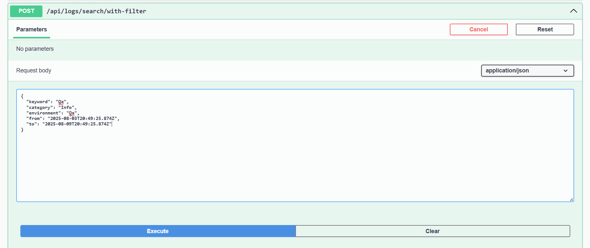
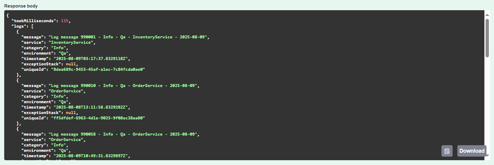
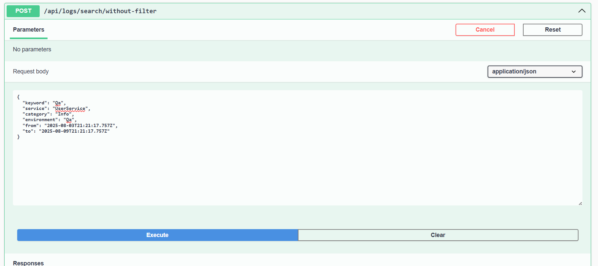
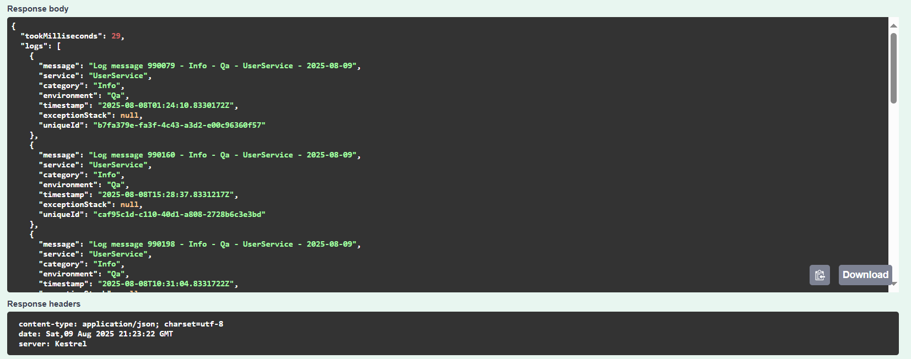
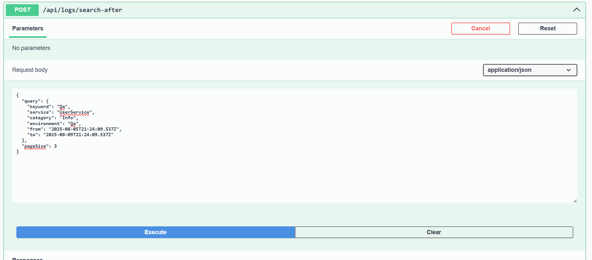
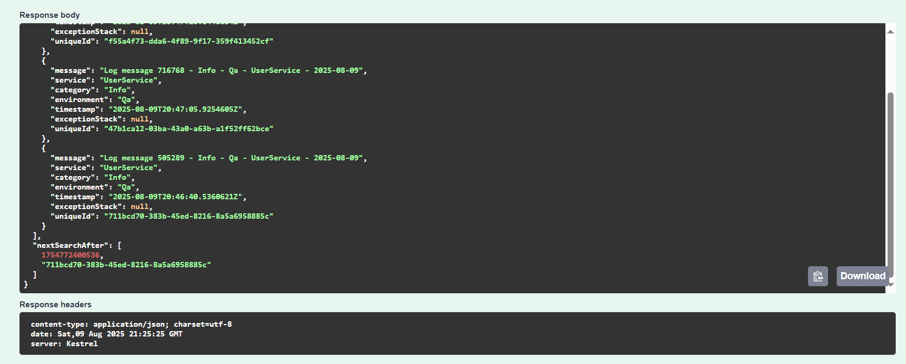
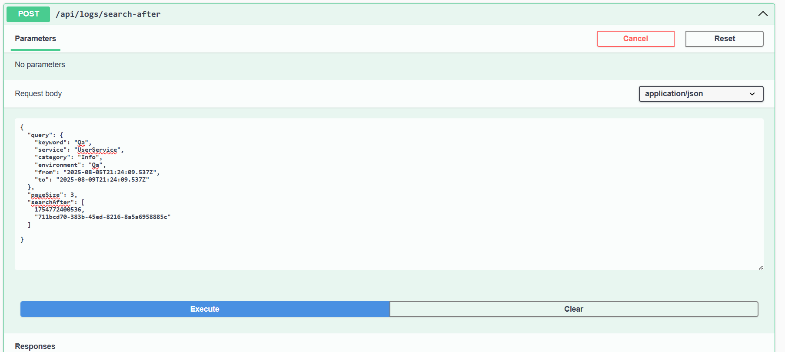
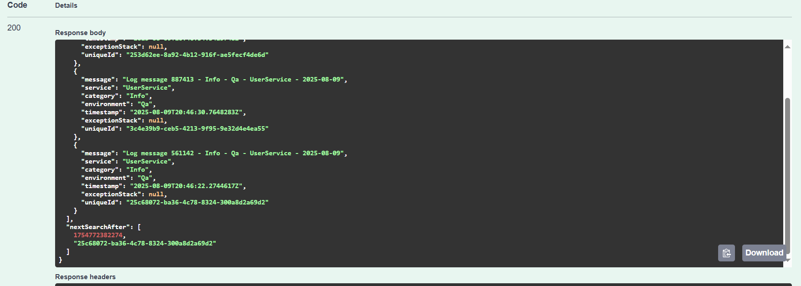

# 📊 ElastiSearchPOC – Log Search API using ASP.NET Core (.NET 8) + Elasticsearch + NEST

This Proof of Concept (PoC) implements a lightweight log management API using ASP.NET Core (.NET 8) and Elasticsearch. It provides endpoints to:

- Index log entries into Elasticsearch
- Search logs with filters like service name, log level, environment, and timestamp range
- Demonstrate optimized search using time-based indices, keyword mapping, and deep pagination

The API is integrated with the NEST client and configured to work with a local Elasticsearch instance running in Docker. This setup mimics a production-like logging pipeline with search and analytics support.

---

## 🛠 Prerequisites

- [.NET 8 SDK](https://dotnet.microsoft.com/download)
- [Docker Desktop](https://www.docker.com/products/docker-desktop/)
- Visual Studio 2022 (or Visual Studio Code)

---

## 🐳 Step 1: Run Elasticsearch Using Docker

Start a single-node Elasticsearch container:

```sh
docker run -d --name elasticsearch-poc -p 9200:9200 \
  -e "discovery.type=single-node" \
  -e "xpack.security.enabled=false" \
  docker.elastic.co/elasticsearch/elasticsearch:8.13.4
```
- This will pull and run Elasticsearch 8.13.4.
- The container exposes port `9200` for HTTP.
- Security is disabled for local development.

**To stop and remove the container:**
```sh
docker stop elasticsearch-poc 
docker rm elasticsearch-poc
```

---

## Step 2: Configure the Project to Connect to Elasticsearch

The project is already configured to connect to `http://localhost:9200` in `Program.cs`:
No further changes are needed if you are running Elasticsearch locally on the default port.
```csharp
builder.Services.AddSingleton<IElasticClient>(sp => 
    { 
        var settings = new ConnectionSettings(new Uri("http://localhost:9200")).DefaultIndex("logs-*"); 
        return new ElasticClient(settings); 
    });
```

---

## Step 3: Run the Project

1. Build and run the project from Visual Studio 2022 or using the .NET CLI.
2. The API will be available at `https://localhost:5001` (or the port shown in the console).
3. Swagger UI is enabled in development mode for easy testing.

---

## Step 4: Test the Connection

- Open [http://localhost:5001/swagger](http://localhost:5001/swagger) in your browser.
- Use the available endpoints to index and search logs.

---

## Elasticsearch Log Search Optimization Implementation

This section outlines the optimization strategies implemented for efficient log searching in Elasticsearch.

### ✅ Time-Based Indices
- Implemented daily indices with naming pattern: `logs-YYYY-MM-DD`
- Benefits:
  - Efficient indexing
  - Easier data archiving and deletion
  - Faster queries on recent logs

### ✅ Data Stream Integration
- Configured a data stream with alias `logs-`
- Elasticsearch automatically manages:
  - Backing indices: `.ds-logs-000001`, `.ds-logs-000002`, etc.
- Unified write endpoint simplifies log ingestion
- No need to manage individual indices manually
- We have added datastream as below
```csharp
var existsResponse = await _client.Indices.TemplateV2ExistsAsync(templateName);
if (existsResponse.Exists)
{
    var getDataStreamResponse = await _client.Indices.GetDataStreamAsync("logs");
    if(!getDataStreamResponse.DataStreams.Any())
    {
        var createDataStreamResponseR = await _client.Indices.CreateDataStreamAsync("logs");
        if (!createDataStreamResponseR.IsValid)
        {
            throw new Exception($"Failed to create data stream: {createDataStreamResponseR.ServerError}");
        }
    }
    return;
}
```

### ✅ Filter-Based Queries
- Queries use filters for high performance:
```json
{
  "query": {
    "bool": {
      "filter": [
        { "match": { "message": "Debug" } },
        { "term": { "category": "Debug" } },
        { "term": { "service": "UserService" } },
        { "term": { "environment": "Qa" } },
        { "range": { "@timestamp": { "gte": "now-1d" } } }
      ]
    }
  }
}
```
- Filters are cacheable and do not compute scores → faster search

### ✅ Index Mapping Optimization
- Keyword fields used for:
  - `service`, `category`, `environment`, etc.
- Disabled indexing on unnecessary fields using:
```json
"fields": {
  "exception_stack": {
    "type": "object",
    "enabled": false
  }
}
```

### ✅ Keyword Field Usage
- Ensured all fields used in filtering/sorting are of type `keyword`
- Examples:
```json
"service": { "type": "keyword" },
"category": { "type": "keyword" },
"environment": { "type": "keyword" }
```
- Optimized for aggregations and filter clauses

### ✅ Deep Pagination Optimization
- Replaced `from + size` with `search_after` for large result sets:
```json
{
  "size": 100,
  "query": { ... },
  "search_after": ["2025-06-18T14:00:00", "8cd19658-6443-4b38-817e-8600d6be6bf7"],
  "sort": [
    { "@timestamp": "desc" },
    { "uniqueId": "desc" }
  ]
}
```
- Prevents high memory usage on deep scroll

---

## 🧯 Troubleshooting

- ✅ Ensure Docker is running: `docker ps`
- 🔁 Restart the container if needed: `docker restart elasticsearch-poc`
- 🔌 Update `Program.cs` if using a different Elasticsearch port or host
- 🔐 For production: enable security and configure credentials

---

## 📸 Output / Result Snapshots

### With Term filter



### With Query Fields only



### With Search After Pagination First Request



### With Search After Pagination



---

## References

- [Elasticsearch Docker Documentation](https://www.elastic.co/guide/en/elasticsearch/reference/current/docker.html)
- [NEST .NET Client](https://www.elastic.co/guide/en/elasticsearch/client/net-api/current/index.html)
